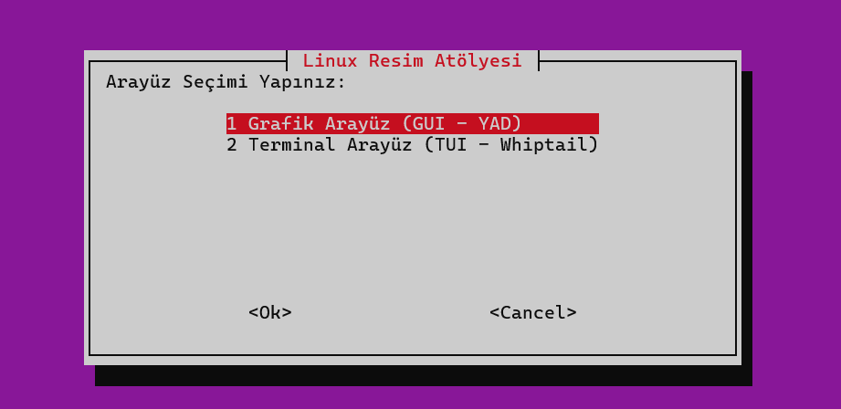
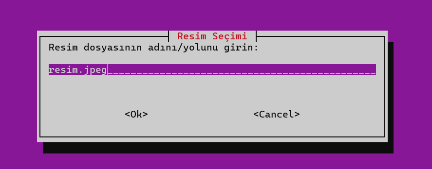
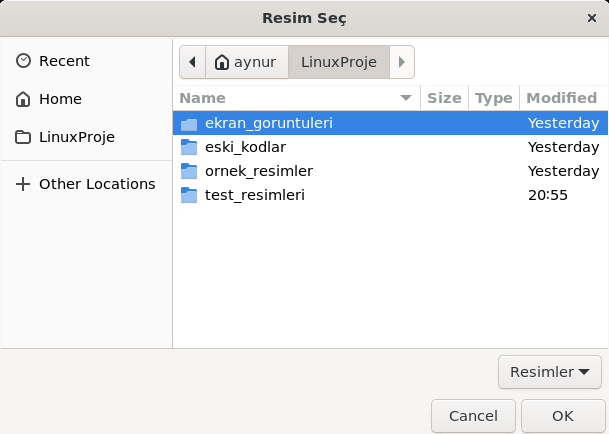
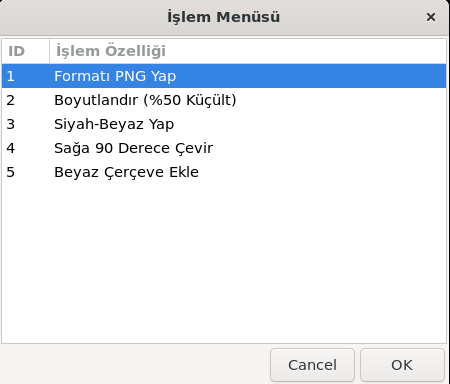
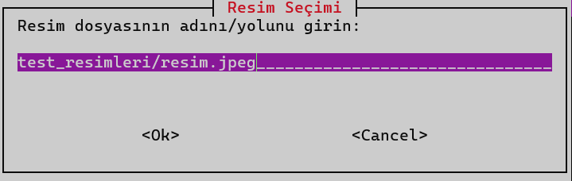
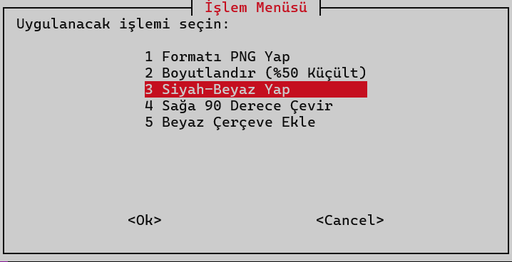

# 🎨 Linux Resim İşleme Atölyesi (ImageMagick Frontend)

Bu proje, **Linux Araçları ve Kabuk Programlama** dersi dönem projesi kapsamında geliştirilmiştir. Linux terminalinde güçlü bir resim işleme aracı olan **ImageMagick** için kullanıcı dostu bir arayüz sağlar.

Kullanıcılar, karmaşık terminal komutları yazmak zorunda kalmadan, hem **Grafik Arayüz (GUI)** hem de **Terminal Arayüzü (TUI)** üzerinden resimlerini kolayca düzenleyebilirler.

## 🚀 Özellikler

Proje aşağıdaki 5 temel resim işleme fonksiyonunu içerir:
* **Format Dönüştürme:** JPG/JPEG dosyalarını PNG formatına çevirir.
* **Boyutlandırma:** Resmi %50 oranında küçültür (Dosya boyutundan tasarruf sağlar).
* **Efekt Uygulama:** Renkli resimleri Siyah-Beyaz (Gri tonlamalı) yapar.
* **Döndürme:** Resmi sağa 90 derece döndürür.
* **Çerçeve Ekleme:** Resmin etrafına şık bir beyaz çerçeve (Polaroid tarzı) ekler.

## 🛠️ Kullanılan Teknolojiler

Proje tamamen **Bash Shell Script** diliyle yazılmıştır ve şu araçları kullanır:
* **ImageMagick (`convert`):** Arka plandaki resim işleme motoru.
* **YAD (Yet Another Dialog):** Modern pencereli grafik arayüz (GUI) için.
* **Whiptail:** Terminal içi menü tabanlı arayüz (TUI) için.

## 🐧 Sistem Gereksinimleri ve Uyumluluk

Bu proje, **Ubuntu/WSL** ortamında geliştirilmiş olup, **Pardus (19/21/23)** ve diğer **Debian** tabanlı dağıtımlarla (Kali, Mint, Debian) **%100 uyumludur**.

Kod yapısı, Pardus depolarında standart olarak bulunan paketleri (`bash`, `apt`, `imagemagick`) kullandığı için ek bir konfigürasyon gerektirmeden sorunsuz çalışır.

## ⚙️ Kurulum

Projenin çalışması için PARDUS veya Ubuntu/Debian tabanlı bir sistemde aşağıdaki paketlerin yüklü olması gerekir.

1.  **Projeyi Klonlayın:**
    ```bash
    git clone [https://github.com/Aynur-Ad/Linux_ResimIsleme_Projesi.git](https://github.com/Aynur-Ad/Linux_ResimIsleme_Projesi.git)
    cd Linux_ResimIsleme_Projesi
    ```

2.  **Gerekli Paketleri Yükleyin:**
    ```bash
    sudo apt update
    sudo apt install imagemagick yad whiptail
    ```
    *(Not: Eğer mouse imleci görünmüyorsa `sudo apt install adwaita-icon-theme-full dmz-cursor-theme` komutunu uygulayın.)*

3.  **Çalıştırma İzni Verin:**
    ```bash
    chmod +x resim_atolyesi.sh
    ```

## 📖 Kullanım Kılavuzu

Programı çalıştırmak için terminale şu komutu yazın:

```bash
./resim_atolyesi.sh
```

### 1. Arayüz Seçimi
Program başladığında hangi arayüzü kullanmak istediğinizi sorar:

<div align="center">
   
   <br><br>
</div>

### 2. Grafik Arayüz (GUI) Modu
Fare ile tıklayarak dosya seçebilir ve işlem yapabilirsiniz.

* **Dosya Seçimi:** İşlenecek resmi bilgisayarınızdan seçin.
* **İşlem Menüsü:** Yapmak istediğiniz işlemi listeden seçip "Başlat" butonuna basın.

<div align="center">
  
  <br><br>
  
  <br><br>
  
</div>

### 3. Terminal Arayüz (TUI) Modu
Sadece klavye (Yön tuşları ve Enter) kullanarak hızlıca işlem yapabilirsiniz.

<div align="center">
  
  <br><br>
  
  <br><br>
</div>

⚖️ Kaynakça ve Etik Bildirim
Proje tanıtımında ve test aşamasında kullanılan örnek görseller, telif hakkı serbest (Royalty Free) kaynaklardan temin edilmiştir:

  Kedi Görseli: Pixabay - Kedi Yavrusu

  Manzara Görseli: iStock/Pixabay - Karagöl
